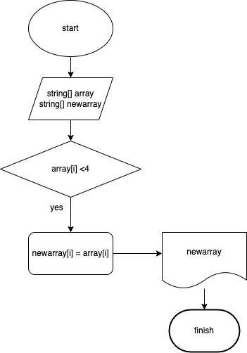

Программный код для вывода массива с элементами первоначального массива.
Проект реализован в качестве домашнего задания курса "Выбор специализации"

Задача: Написать программу, которая из имеющегося массива строк формирует новый массив из строк, длина которых меньше, либо равна 3 символам. Первоначальный массив можно ввести с клавиатуры, либо задать на старте выполнения алгоритма. При решении не рекомендуется пользоваться коллекциями, лучше обойтись исключительно массивами.

Примеры:

[“Hello”, “2”, “world”, “:-)”] → [“2”, “:-)”]

[“1234”, “1567”, “-2”, “computer science”] → [“-2”]

[“Russia”, “Denmark”, “Kazan”] → []

Для решения задачи были реализованы 2 метода: PrintArray для вывода массива и New3SimbolsArray для сохранения выбранных элементов в новый массив.

Блок-схема решения задачи:

